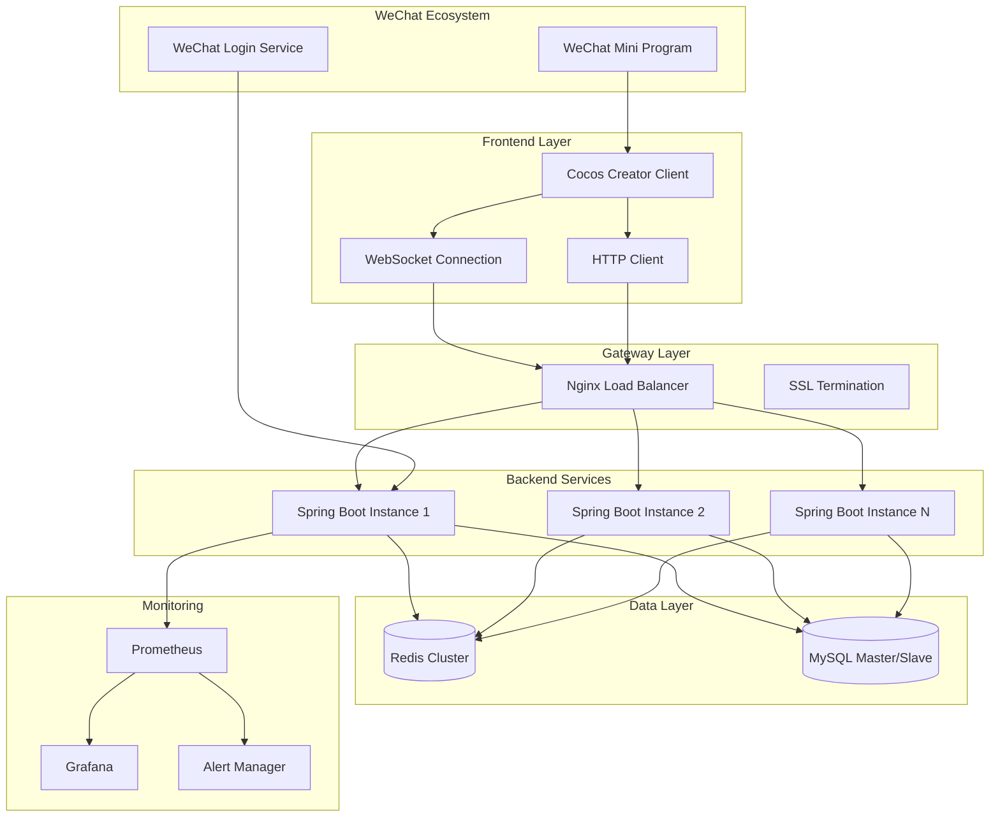

# Design Document

## Overview

The 3-player Mahjong game system is designed as a distributed real-time multiplayer game with a Cocos Creator frontend for WeChat Mini Program and a Spring Boot backend. The architecture emphasizes low latency, high availability, and configurable gameplay rules to support regional variations of Mahjong.

The system handles real-time game state synchronization, complex rule validation, and persistent game records while maintaining sub-200ms response times for optimal user experience.

## Architecture

### High-Level Architecture



### Service Architecture

The backend follows a modular monolith approach with clear service boundaries:

- **Auth Service**: WeChat authentication, JWT management, user sessions
- **Lobby Service**: Room management, matchmaking, player profiles
- **Game Service**: Real-time game logic, state management, rule validation
- **Settlement Service**: Score calculation, game records, statistics
- **Admin Service**: Monitoring, user management, system configuration

## Components and Interfaces

### Frontend Components (Cocos Creator)

#### Scene Management
- **LoginScene**: WeChat authorization and user onboarding
- **LobbyScene**: Room creation, joining, and player dashboard
- **GameScene**: Main gameplay interface with tile rendering and interactions
- **SettlementScene**: Game results and score display
- **HistoryScene**: Game records and replay functionality

#### Core Game Components
```typescript
// Game State Manager
interface GameStateManager {
    currentState: GameState;
    playerHand: Tile[];
    discardPile: Tile[];
    gameConfig: RoomConfig;
    
    updateGameState(snapshot: GameSnapshot): void;
    validateLocalAction(action: PlayerAction): boolean;
    sendAction(action: PlayerAction): void;
}

// Network Manager
interface NetworkManager {
    connect(token: string): Promise<void>;
    sendMessage(message: GameMessage): void;
    onMessage(callback: (message: GameMessage) => void): void;
    reconnect(): Promise<GameSnapshot>;
}

// UI Controller
interface GameUIController {
    renderHand(tiles: Tile[]): void;
    showActionButtons(actions: ActionType[]): void;
    displayGameState(state: GameState): void;
    playAnimation(type: AnimationType): void;
}
```

### Backend Components (Spring Boot)

#### WebSocket Message Handler
```java
@Component
public class GameWebSocketHandler extends TextWebSocketHandler {
    
    @Autowired
    private GameService gameService;
    
    @Autowired
    private RoomService roomService;
    
    @Override
    public void afterConnectionEstablished(WebSocketSession session) {
        // Handle connection, authenticate user
    }
    
    @Override
    protected void handleTextMessage(WebSocketSession session, TextMessage message) {
        // Route messages to appropriate service handlers
        GameMessage gameMessage = parseMessage(message.getPayload());
        gameService.handlePlayerAction(session, gameMessage);
    }
}
```

#### Game Service Interface
```java
@Service
public interface GameService {
    void startGame(String roomId);
    void handlePlayerAction(WebSocketSession session, GameMessage message);
    GameSnapshot getGameSnapshot(String roomId, String userId);
    void processPlayerDisconnection(String userId, String roomId);
    SettlementResult calculateSettlement(String gameId);
}
```

#### Room Management Service
```java
@Service
public interface RoomService {
    Room createRoom(String ownerId, RoomConfig config);
    void joinRoom(String roomId, String userId);
    void leaveRoom(String roomId, String userId);
    void dissolveRoom(String roomId, String requesterId);
    List<Room> getActiveRooms();
}
```

## Data Models

### Core Game Entities

#### User Model
```java
@Entity
@Table(name = "t_user")
public class User {
    @Id
    private Long id;
    
    @Column(unique = true)
    private String openId;
    
    private String unionId;
    private String nickname;
    private String avatar;
    private Integer coins;
    private Integer roomCards;
    private UserStatus status;
    private LocalDateTime createdAt;
    private LocalDateTime updatedAt;
}
```

#### Room Model
```java
@Entity
@Table(name = "t_room")
public class Room {
    @Id
    private String id; // 6-digit room number
    
    private Long ownerId;
    private RoomStatus status;
    private Long ruleId;
    private Long currentDealerUserId;
    private Integer roundIndex;
    private Integer maxRounds;
    private LocalDateTime createdAt;
    private LocalDateTime updatedAt;
    
    @OneToMany(mappedBy = "room")
    private List<RoomPlayer> players;
}
```

#### Game State Model (Redis)
```java
public class GameState {
    private String roomId;
    private String gameId;
    private List<PlayerState> players;
    private List<Tile> tileWall;
    private List<Tile> discardPile;
    private Integer currentPlayerIndex;
    private Long turnStartTime;
    private GamePhase phase;
    private RoomConfig config;
    private String dealerUserId;
    private Integer remainingTiles;
}

public class PlayerState {
    private String userId;
    private List<Tile> handTiles;
    private List<MeldSet> melds; // Peng, Gang sets
    private Integer seatIndex;
    private PlayerStatus status;
    private Boolean isDealer;
    private Integer score;
}
```

#### Configuration Model
```java
@Entity
@Table(name = "t_room_rule")
public class RoomRule {
    @Id
    private Long id;
    
    private String name;
    
    @Column(columnDefinition = "json")
    private RoomConfig config;
    
    public static class RoomConfig {
        private Integer players = 3;
        private String tiles = "WAN_ONLY";
        private Boolean allowPeng = true;
        private Boolean allowGang = true;
        private Boolean allowChi = false;
        
        private HuTypes huTypes;
        private ScoreConfig score;
        private TurnConfig turn;
        private DealerConfig dealer;
        private Boolean replay = true;
        private DismissConfig dismiss;
    }
}
```

### Message Protocol

#### WebSocket Message Structure
```java
public class GameMessage {
    private MessageType type; // EVENT, REQ, RESP, ERROR
    private String cmd;       // JoinRoom, Play, Peng, Gang, Hu, etc.
    private String reqId;     // Optional request ID for correlation
    private String roomId;
    private Object data;      // Command-specific payload
    private Long timestamp;
}
```

#### Key Message Types
```java
// Player Actions (Client -> Server)
public class PlayAction {
    private String tile; // e.g., "5W"
}

public class GangAction {
    private GangType type; // MING, AN, BU
    private String tile;
}

// Server Events (Server -> Client)
public class GameSnapshot {
    private String roomId;
    private List<PlayerSnapshot> players;
    private List<String> discardPile;
    private Integer remainingTiles;
    private Integer currentPlayerIndex;
    private Long turnDeadline;
    private List<ActionType> availableActions;
}

public class SettlementEvent {
    private String gameId;
    private List<PlayerResult> results;
    private List<GangScore> gangScores;
    private List<PlayerScore> totalScores;
}
```

## Error Handling

### Client-Side Error Handling

#### Network Error Recovery
```typescript
class NetworkErrorHandler {
    private reconnectAttempts = 0;
    private maxReconnectAttempts = 5;
    private reconnectDelay = 1000;
    
    async handleDisconnection(): Promise<void> {
        while (this.reconnectAttempts < this.maxReconnectAttempts) {
            try {
                await this.networkManager.reconnect();
                const snapshot = await this.networkManager.requestSnapshot();
                this.gameStateManager.updateGameState(snapshot);
                return;
            } catch (error) {
                this.reconnectAttempts++;
                await this.delay(this.reconnectDelay * this.reconnectAttempts);
            }
        }
        this.showConnectionFailedDialog();
    }
}
```

#### Game State Validation
```typescript
class GameStateValidator {
    validateAction(action: PlayerAction, currentState: GameState): ValidationResult {
        // Validate action against current game state
        // Return validation result with error details if invalid
    }
    
    reconcileWithServer(localState: GameState, serverSnapshot: GameSnapshot): void {
        // Handle state discrepancies between client and server
        // Always trust server state for authoritative data
    }
}
```

### Server-Side Error Handling

#### Exception Handling Strategy
```java
@ControllerAdvice
public class GameExceptionHandler {
    
    @ExceptionHandler(InvalidGameActionException.class)
    public ResponseEntity<ErrorResponse> handleInvalidAction(InvalidGameActionException e) {
        return ResponseEntity.badRequest()
            .body(new ErrorResponse("INVALID_ACTION", e.getMessage()));
    }
    
    @ExceptionHandler(RoomNotFoundException.class)
    public ResponseEntity<ErrorResponse> handleRoomNotFound(RoomNotFoundException e) {
        return ResponseEntity.notFound()
            .body(new ErrorResponse("ROOM_NOT_FOUND", e.getMessage()));
    }
    
    @ExceptionHandler(GameStateException.class)
    public void handleGameStateError(GameStateException e, WebSocketSession session) {
        // Send error message via WebSocket
        sendErrorMessage(session, "GAME_STATE_ERROR", e.getMessage());
        // Optionally send fresh game snapshot to recover
    }
}
```

#### Data Consistency
```java
@Service
@Transactional
public class GameConsistencyService {
    
    public void saveGameState(GameState gameState) {
        try {
            // Save to Redis for real-time access
            redisTemplate.opsForValue().set(
                "game:" + gameState.getRoomId(), 
                gameState, 
                Duration.ofHours(2)
            );
            
            // Async save to MySQL for persistence
            gameRecordService.saveGameSnapshot(gameState);
            
        } catch (Exception e) {
            log.error("Failed to save game state for room: {}", gameState.getRoomId(), e);
            // Implement recovery strategy
        }
    }
    
    public GameState recoverGameState(String roomId) {
        // Try Redis first, fallback to MySQL
        GameState state = redisTemplate.opsForValue().get("game:" + roomId);
        if (state == null) {
            state = gameRecordService.getLatestGameSnapshot(roomId);
        }
        return state;
    }
}
```

## Testing Strategy

### Unit Testing

#### Game Logic Testing
```java
@ExtendWith(MockitoExtension.class)
class MahjongGameLogicTest {
    
    @Mock
    private RoomConfig roomConfig;
    
    @InjectMocks
    private MahjongGameLogic gameLogic;
    
    @Test
    void shouldValidateWinningHand_BasicWin() {
        // Test basic winning hand validation
        List<Tile> hand = createBasicWinningHand();
        Tile winningTile = new Tile("5W");
        
        WinValidationResult result = gameLogic.validateWin(hand, winningTile, roomConfig);
        
        assertTrue(result.isValid());
        assertEquals(1, result.getBaseFan());
    }
    
    @Test
    void shouldCalculateScore_WithMultipliers() {
        // Test score calculation with various multipliers
        WinResult winResult = createWinResult();
        when(roomConfig.getScore()).thenReturn(createScoreConfig());
        
        SettlementResult settlement = gameLogic.calculateSettlement(winResult, roomConfig);
        
        assertEquals(24, settlement.getWinnerScore());
        assertEquals(-12, settlement.getLoserScores().get(0));
    }
}
```

#### WebSocket Integration Testing
```java
@SpringBootTest(webEnvironment = SpringBootTest.WebEnvironment.RANDOM_PORT)
class GameWebSocketIntegrationTest {
    
    @Autowired
    private TestRestTemplate restTemplate;
    
    @Test
    void shouldHandlePlayerActions() throws Exception {
        // Test WebSocket message handling
        WebSocketStompClient stompClient = new WebSocketStompClient(new SockJsClient());
        StompSession session = stompClient.connect("ws://localhost:" + port + "/game", 
                                                  new StompSessionHandlerAdapter()).get();
        
        // Send player action
        session.send("/app/room/123456/play", new PlayAction("5W"));
        
        // Verify response
        // Assert game state changes
    }
}
```

### Integration Testing

#### End-to-End Game Flow
```java
@SpringBootTest
@Testcontainers
class GameFlowIntegrationTest {
    
    @Container
    static RedisContainer redis = new RedisContainer("redis:6-alpine");
    
    @Container
    static MySQLContainer mysql = new MySQLContainer("mysql:8.0");
    
    @Test
    void shouldCompleteFullGameFlow() {
        // Create room
        Room room = roomService.createRoom(userId1, defaultConfig);
        
        // Join players
        roomService.joinRoom(room.getId(), userId2);
        roomService.joinRoom(room.getId(), userId3);
        
        // Start game
        gameService.startGame(room.getId());
        
        // Simulate game actions
        simulateGamePlay(room.getId());
        
        // Verify settlement
        SettlementResult result = gameService.getSettlementResult(room.getId());
        assertNotNull(result);
        assertTrue(result.getTotalScores().size() == 3);
    }
}
```

### Performance Testing

#### Load Testing Strategy
```java
@Component
public class GameLoadTester {
    
    public void simulateConcurrentRooms(int roomCount, int actionsPerSecond) {
        ExecutorService executor = Executors.newFixedThreadPool(roomCount * 3);
        
        for (int i = 0; i < roomCount; i++) {
            String roomId = createTestRoom();
            
            // Simulate 3 players per room
            for (int j = 0; j < 3; j++) {
                executor.submit(() -> simulatePlayerActions(roomId, actionsPerSecond));
            }
        }
        
        // Monitor performance metrics
        monitorPerformance(Duration.ofMinutes(10));
    }
    
    private void monitorPerformance(Duration duration) {
        // Track response times, memory usage, error rates
        // Assert performance requirements are met
    }
}
```

### Automated Testing Pipeline

#### Test Categories
1. **Unit Tests**: Game logic, score calculation, rule validation
2. **Integration Tests**: Service interactions, database operations
3. **WebSocket Tests**: Real-time message handling, connection management
4. **Performance Tests**: Load testing, stress testing, endurance testing
5. **Security Tests**: Authentication, authorization, input validation
6. **Compatibility Tests**: WeChat Mini Program integration, different devices

#### Continuous Testing
- Run unit and integration tests on every commit
- Performance tests on staging environment daily
- Full end-to-end tests before production deployment
- Automated regression testing for rule configuration changes